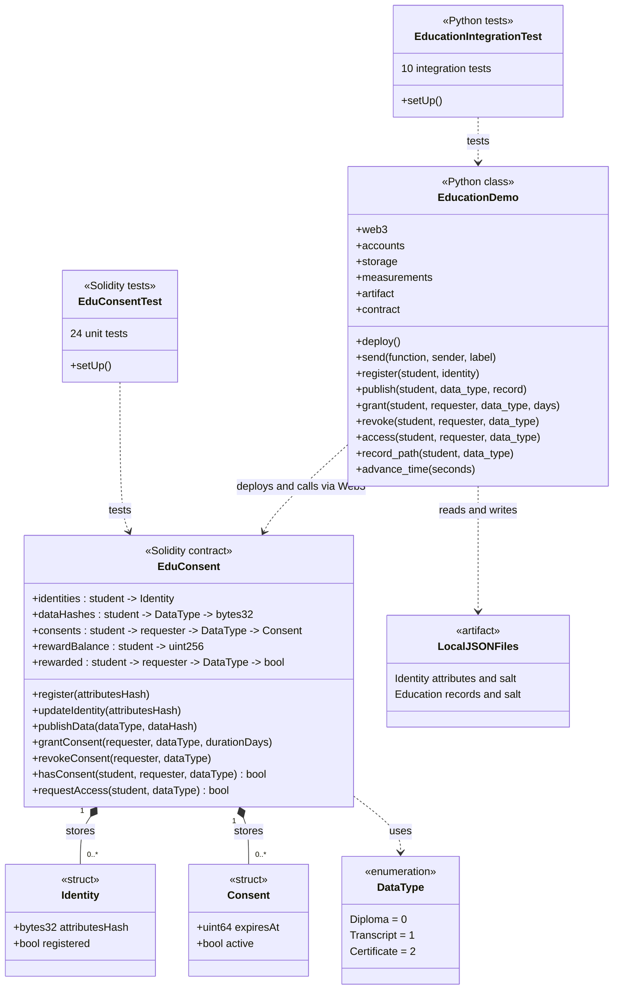

# EduConsent UML class diagram

Open `uml.svg` to see the diagram. The editable Graphviz source is `uml.dot`.
The Mermaid version below can also be used in a Markdown preview that supports Mermaid.

`+` means public. Solid lines with a filled diamond show stored structures;
dashed arrows show dependencies. `student` and `requester` are wallet addresses,
not separate classes. `LocalJSONFiles` is a file artifact, not a Python class.
Mapping keys are shown with arrows to keep them readable.

The contract emits events for identity registration and updates, data publication,
consent grants and revocations, rewards and access attempts. Those events are not
separate contracts or classes. The Python helper uses the access event, checks
current consent and compares hashes before releasing a local record. Only hashes,
permissions, rewards and event logs go on-chain; the files stay off-chain.
