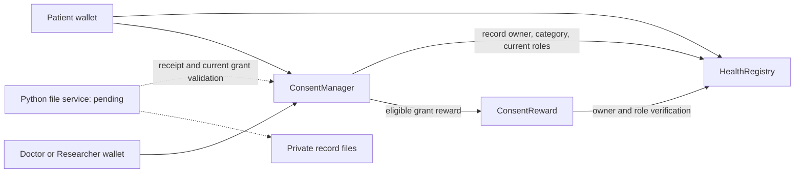

# Healthcare contract integration

The deployer configures the reward issuer after deploying the actual manager; deployment
authority does not allow granting/revoking patient consent. Registry stores commitments
and immutable metadata. Manager records grant/revocation/request events, enforces exact
record scope and current verification, and calls rewards atomically with grant creation.

The three contracts are deployed and tested together. The pending file service must
enforce actual private delivery. It remains trusted, and no decision event proves a
person received/read a file. Revocation cannot delete copies already delivered.

`docs/UML.md` and its images are retained historical education diagrams; this page
describes the current healthcare architecture.
